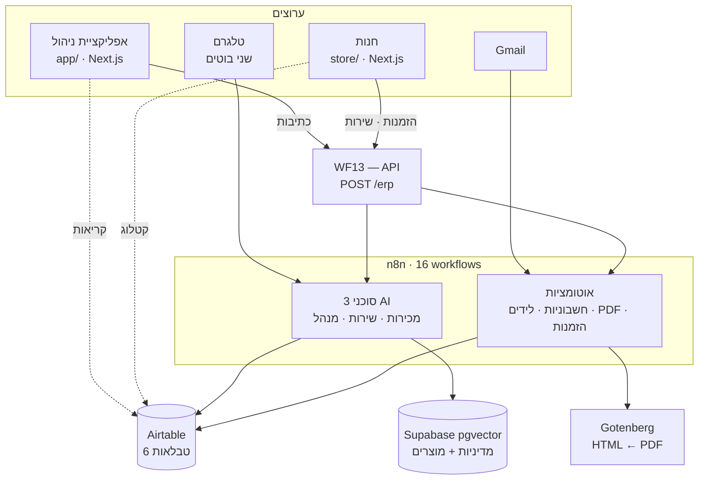

# איי.איי אלקטרוניקה — מערכת ERP מונעת סוכני AI

פרויקט גמר. חנות ציוד אלקטרוני קטנה שבה **הפעולות המשרדיות עושות את עצמן**: חשבונית שנכנסת
מאומתת ומקבלת מע"מ ומספר תוך דקה, ליד חדש נבדק מול כפילויות ומקבל מייל קר בעברית, לקוח
שמזמין בחנות מקבל אישור ו-PDF, ושלושה סוכני AI עונים לשאלות — בטלגרם, באפליקציה ובחנות.

הליבה היא **n8n** עם 16 workflows, **Airtable** כמסד הנתונים, ו-**Supabase pgvector** ל-RAG.
מעליהם שני אתרי Next.js שנכתבו בקוד: אפליקציית ניהול וחנות ללקוח.

| | קישור |
|---|---|
| אפליקציית ניהול | https://ai-erp-rho.vercel.app (מוגנת בסיסמה) |
| חנות ללקוח | https://ai-electronics-one.vercel.app (פתוחה) |
| בוט מנהל | [@aielc_manager_bot](https://t.me/aielc_manager_bot) — עונה רק לבעל העסק |
| בוט שירות | [@aielec_support_bot](https://t.me/aielec_support_bot) |
| סרט תדמית | `film/out/ai-electronics-erp-film.mp4` (3:54) |

> **הערה למי שבודק:** ה-n8n רץ מקומית על מחשב הסטודנט מאחורי ngrok (Render בחינם נרדם אחרי
> 15 דקות ולא מתאים לטריגרים). קטלוג המוצרים בחנות נקרא ישירות מ-Airtable ולכן הוא עובד תמיד,
> אבל **קופה, מעקב הזמנות והבוטים פעילים רק כשהמחשב דולק**. לתיאום הדגמה חיה — ראו `docs/demo.md`.

## איך זה בנוי



הכלל שמחזיק את הכל: **קריאות ישירות מ-Airtable, כתיבות אך ורק דרך WF13.** אף אתר לא כותב
ל-Airtable בעצמו, ולכן כל שינוי במצב עובר במקום אחד שאפשר לתעד, לאבטח ולנטר.

## מה יש בכל תיקייה

| תיקייה | מה זה |
|---|---|
| `app/` | אפליקציית הניהול. Next.js 16, אימות בסיסמה, 130 בדיקות. [README](app/README.md) |
| `store/` | החנות ללקוח. Next.js 16, ציבורית, 125 בדיקות. [README](store/README.md) |
| `n8n/` | לב המערכת: 16 תבניות workflow, פרומפטים של הסוכנים, קוד עזר, docker-compose, סקריפטים |
| `airtable/` | סכימת הנתונים ([schema.md](airtable/schema.md)) וסקריפטים ליצירה, זריעה ואימות |
| `docs/` | [runbook.md](docs/runbook.md) — הפעלה ותקלות · [demo.md](docs/demo.md) — סקריפט הדגמה · `course/` — חומרי הקורס והמדיניות שמוזנת ל-RAG |
| `film/` | סרט התדמית: קוד HyperFrames, קריינות, וצילומי מסך אמיתיים מהמערכת |
| `tasks/` | [todo.md](tasks/todo.md) — מה נשאר · [lessons.md](tasks/lessons.md) — יומן תקלות ולקחים |

## שישה עשר ה-workflows

| | מה עושה | טריגר |
|---|---|---|
| WF1 | מאמת חשבונית, מחשב מע"מ לפי תאריך המסמך (18%, 17% לפני 2025), מקצה `INV-000N` | Airtable, פולינג |
| WF2 | מזהה לידים כפולים לפי מייל, ואם אין — לפי טלפון | Airtable, פולינג |
| WF3 | סוכן מכירות: כותב ושולח מייל קר בעברית | תזמון + webhook |
| WF4 | תשובה למייל הקר מסווגת: מעוניין → Qualified + משימת שיחה; לא מעוניין / "הסר" → Dead; אוטומטי → מתעלמים | Gmail, פולינג |
| WF5 | בוט השירות: תפריט, קטלוג, לכידת ליד. הליבה משותפת עם החנות | Telegram webhook |
| WF6 / WF7 | מטמיעים את המדיניות ואת הקטלוג ל-pgvector | webhook |
| WF8 | בונה PDF לחשבונית (Gotenberg), מעלה לדרייב ומשתף | תזמון, עם lease |
| WF9 | בוט המנהל: סיכומים כספיים, רק לבעל העסק | Telegram webhook |
| WF10 | צינור ההזמנה: תמחור מהקטלוג, מספור, מלאי, מייל, התראה | קריאה מ-WF13 |
| WF13 | ה-API היחיד שחשוף החוצה — מנתב הכל | webhook |
| WF-Health | בודק כל שעה שטוקני Gmail ו-Drive חיים; כשל → התראה עם הוראת Reconnect | כל שעה |
| WF-Error | כל כשל במערכת מגיע כהתראה לטלגרם; ואם גם היא נכשלת — כמשימה ב-Airtable | Error trigger |

## איך בודקים בלי להריץ כלום

1. **סרט התדמית** (3:54) מראה את כל הזרימות מקצה לקצה, עם צילומי מסך אמיתיים.
2. **[docs/demo.md](docs/demo.md)** — כל תרחיש, מה אמור לקרות, וכמה זמן זה לוקח.
3. **[tasks/lessons.md](tasks/lessons.md)** — יומן של תקלות אמיתיות ושורשיהן. הביקורת הלילית שם
   מתעדת שמונה באגים שנמצאו ותוקנו, כולל עקיפת אימות דרך סיומת קובץ ומע"מ שחושב פעמיים.
4. **הבדיקות** — 255 בדיקות יחידה (`pnpm test` בכל אחת מהאפליקציות, בלי צורך במשתני סביבה) ועוד 28 על צמתי ה-Code של n8n (`cd n8n/code && node --test`).

## הרצה מקומית

```bash
cd n8n && docker compose up -d      # n8n + gotenberg
n8n/scripts/tunnel.sh               # ngrok, בטרמינל נפרד
n8n/scripts/verify-env.sh           # בדיקת שפיות

cd app   && pnpm install && pnpm dev   # 3100
cd store && pnpm install && pnpm dev   # 3200
```

ההקמה המלאה — חשבונות, credentials, סכימת Airtable, Supabase — ב-[docs/runbook.md](docs/runbook.md).

## מגבלות ידועות

מתועדות בכוונה ולא מוסתרות:

- **מספור `ORD`/`INV` הוא max+1 בלי נעילה.** שתי הזמנות באותה שנייה יכולות להתנגש. מקובל בהיקף הזה.
- **הגבלת קצב היא בזיכרון התהליך.** ב-Vercel זה per-instance, כלומר הגנה מפני לחיצה כפולה, לא אבטחה.
- **סטטוסים ב-Airtable הם טקסט חופשי ולא בחירה מרשימה**, כדי ש-n8n לא ייפול על ערך לא מוכר.
  המחיר: שגיאת כתיב בסטטוס לא נתפסת במסד אלא בקוד.
- **טוקני Google OAuth פגים כל 7 ימים** (מצב Testing), ויש לחבר מחדש לפני הדגמה.

## מה נדרש בקורס ומה נבנה מעבר

הארכיטקטורה של הקורס נשמרה במלואה: Airtable, n8n, שלושה סוכנים, RAG, שני בוטים, Gmail, Drive,
WF1–WF9 + WF13, וארבע הטבלאות בשמות השדות המדויקים (`airtable/verify-schema.sh` בודק את זה מול הבסיס החי).
הטבלה הבאה מונה כל מקום שבו הפרויקט **סוטה** מהמסמך בכוונה, כדי שלא יהיה צורך לנחש:

| המסמך אמר | בנינו | למה |
|---|---|---|
| ממשק ב-Lovable / Base44, בלי קוד | שני אתרי Next.js 16 בקוד (`app/`, `store/`), אימות, 250+ בדיקות | שליטה מלאה ב-RTL, בנגישות ובאבטחה; עבודה שאפשר להראות בפורטפוליו |
| `Dashboard.html` בסיסי מהמרצה, "מוזמנים לשפר" | `app/` מחליף אותו במלואו | הקובץ של הקורס הוא HTML אחד עם PAT בדפדפן; כאן כל הקריאות בצד השרת והכתיבות דרך WF13 |
| n8n Cloud | n8n מקומי ב-Docker מאחורי ngrok | Render החינמי נרדם אחרי 15 דקות — לא מתאים לטריגרים. המחיר: הבוטים חיים רק כשהמחשב דולק |
| "אפס קוד" בכל התהליכים | 9 צמתי Code בשישה workflows, הגוף ב-`n8n/code/*.js` עם בדיקות `node:test` | לוגיקה שהפרומפט לבדו לא החזיק (כפילות שורות, זליגת הרהור, סיווג שגיאות רשת, ניתוב טלגרם). קוד נבדק עדיף על ביטוי ארוך בתוך JSON |
| 3–7 צמתים לכל תהליך | WF5 ו-WF10 עם 26 צמתים, WF13 עם 22 | תפריט טלגרם מלא, צינור הזמנה עם תמחור/מלאי/חשבונית/מייל, ו-API עם רשימת היתר. הקטנים נשארו קטנים |
| בלי ריפו, הכל בענן | הכל ב-git: תבניות עם placeholders, פרומפטים, מדיניות, סקריפטי ייבוא ואימות | שחזור מאפס בפקודה אחת; היסטוריה לכל שינוי בפרומפט |
| המדיניות בתיבת טקסט בתוך WF6 | 12 קבצי Markdown ב-`docs/course/policies/` | ניתן לעריכה, לבדיקה ולגרסאות; WF6 קורא אותם מהדיסק ומטמיע מחדש בקריאה אחת |
| מאגר וקטורי בזיכרון, נמחק ב-restart | Supabase pgvector קבוע | לא צריך להריץ WF6+WF7 אחרי כל אתחול. **זיכרון השיחה** של הסוכנים עדיין `memoryBufferWindow` ונמחק ב-restart — החצי הזה של המגבלה נשאר |
| חשבונית כ-HTML בדרייב, המרה ידנית ל-PDF | Gotenberg ב-Docker → PDF אמיתי | הלקוח מקבל PDF בקישור מהמייל ומעמוד ההזמנה |
| WF6/WF7 ידניים ("Execute workflow") | webhooks `reindex-policies` / `reindex-products` | ניתן להריץ מהאפליקציה ומסקריפט, לא רק מהקנבס |
| בלי טיפול בשגיאות ובלי retry — "כך לומדים לקרוא הרצות" | WF-Error לטלגרם + retry על צמתים אידמפוטנטיים בלבד | כשל בלילה מגיע כהודעה, לא מתגלה בבוקר. רעש רשת חולף מסונן |
| WF4: "בודק אם הגיעו תשובות" | Text Classifier: מעוניין → Qualified + משימה; לא מעוניין / "הסר" → Dead; אוטומטי → מתעלמים | בלי סיווג, "השיבו הסר" שהמייל הקר עצמו מבטיח היה הופך למשימת שיחה |
| המנהל רואה עד 100 חשבוניות | `returnAll` על ארבע טבלאות | בהיקף הפרויקט זה עשרות רשומות; התקרה האמיתית היא חלון ההקשר של המודל, ולא נגענו בה |
| "מגיע ריק מנתונים" | 34 מוצרים, לקוחות והזמנות דמו (`airtable/seed*.sh`) | הדגמה חיה צריכה קטלוג; הכל דטרמיניסטי ובטוח להרצה חוזרת |
| הבחנה בין חשבונית / חשבונית מס / קבלה | סוג מסמך אחד: חשבונית מס | הסכימה במסמך עצמו (8 שדות ב-Invoices) לא כוללת שדה לסוג מסמך; הידע על סוגי המסמכים קיים ב-RAG (`06-israeli-tax-invoice-rules.md`) |
| "משימות להיום" בדשבורד | "משימות פתוחות" | ל-Tasks אין תאריך יעד בסכימה של הקורס |

מה שהמסמך דרש ויושר ב-15.9.2026 אחרי סקירת תאימות: WF8 כל דקה (היה 5), מע"מ 17% לפני 1.1.2025 (היה 18% קבוע),
פתק דביק בראש כל workflow, טופס "הזמנה חדשה" בניהול, וחיפוש+סינון בכל מסך טבלה כולל לקוחות, לידים ומשימות.
